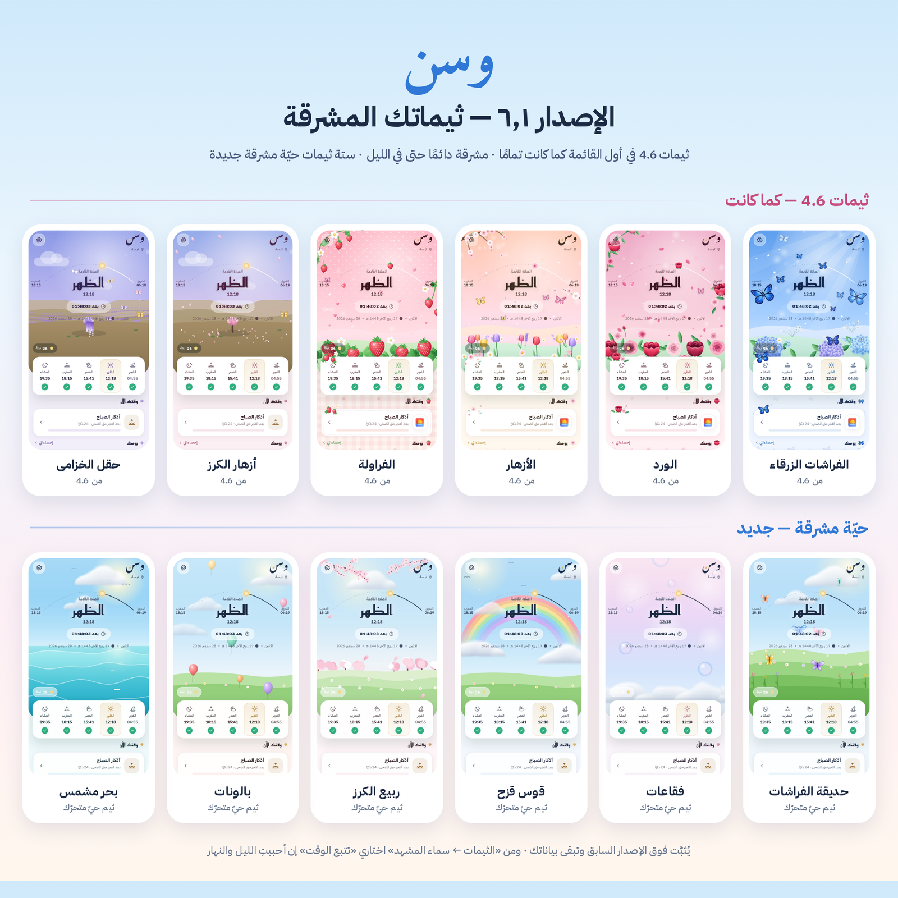

<div dir="rtl">

# وسن · Wasan 6.3

**رفيقك اليومي للصلاة والقرآن والذكر** — تطبيق أندرويد يعمل دون إنترنت ودون إعلانات.



## التحميل

- **التطبيق الجاهز:** [Wasan-6.3.apk](https://github.com/zaldynbwtany202-dev/app-istgfar/releases/download/v6.3/Wasan-6.3.apk) · لمتجر Google Play: [Wasan-6.3.aab](https://github.com/zaldynbwtany202-dev/app-istgfar/releases/download/v6.3/Wasan-6.3.aab) (من صفحة الإصدارات Releases) — يُثبَّت فوق النسخ السابقة مباشرة وتبقى بياناتك.
- النسخ السابقة: [الإصدار 6.2](https://github.com/zaldynbwtany202-dev/app-istgfar/releases/tag/v6.2) · [الإصدار 6.1](https://github.com/zaldynbwtany202-dev/app-istgfar/releases/tag/v6.1) · [الإصدار 6.0](https://github.com/zaldynbwtany202-dev/app-istgfar/releases/tag/v6.0) · [الإصدار 5.1](https://github.com/zaldynbwtany202-dev/app-istgfar/releases/tag/v5.1) · [الإصدار 5.0](https://github.com/zaldynbwtany202-dev/app-istgfar/releases/tag/v5.0) · [الإصدار 4.8](https://github.com/zaldynbwtany202-dev/app-istgfar/releases/tag/v4.8) · [release/Wasan-4.7.apk](release/Wasan-4.7.apk).

## ما الجديد في 6.3 · «الأذان في دقيقته، ومواقيت مسجدك»

- **الأذان في وقته تمامًا:** كان أندرويد 14+ يمنع «المنبّهات الدقيقة» افتراضيًا فيؤخّر المنبّه التقريبي الأذان حتى ساعة (ويُسقطه إن تجاوز ٢٠ دقيقة)، ولم يكن الترحيب يطلب إذن الإشعارات على أندرويد 13+. الآن: الأذان بـ `setAlarmClock` (لا يؤجّله Doze ولا حدود App Standby) والتذكيرات بـ `setExactAndAllowWhileIdle`، ودون الإذن «نقاط تحقّق» تقترب من الوقت (ACTION_TICK)، وإعادة الجدولة عند منح الإذن (SCHEDULE_EXACT_ALARM_PERMISSION_STATE_CHANGED) وعند العودة للتطبيق، وخطوة «ليصلك الأذان في وقته» في الترحيب، وورقة «وصول الأذان» (الموقع · الإشعارات · المنبّهات · البطارية · التشغيل التلقائي لشاومي/أوبو/فيفو/هواوي/سامسونج · أذان بأولوية المنبّه · سجلّ «آخر ما وصل» بالتأخير الفعلي) تظهر وحدها مرة كل ٣ أيام إن نقص شيء.
- **المواقيت لأقرب دقيقة** (الثانية صفر) في الواجهة و WasanTimes معًا، فيُرفع الأذان عند الدقيقة المعروضة.
- **طرق الحساب بفروقها الرسمية:** الأردن وفلسطين (18°/18° والمغرب +5)، تركيا (الشروق −7، الظهر +5، العصر +4، المغرب +7)، المغرب (الظهر والمغرب +5)، الإمارات (الظهر والمغرب +3) — مطابقة لـ Aladhan بالدقيقة في 18 مدينة × 4 تواريخ، والنواة الأصلية تطابق الواجهة (اختُبرت WasanTimes بـ kotlinc).
- **ضبط المواقيت على مسجدك** (`calib`): تُدخل مواقيت يوم (أو ثلاثة) من تقويم مسجدك أو الوزارة، فيستنتج `NoorEngine.calibrate` زاويتي الفجر والعشاء (أو دقائق العشاء بعد المغرب) ومذهب العصر وفروق الدقائق، ويعرض مطابقة الإدخال وجدول ٧ أيام، ثم تُحسب به كل الأيام والأذان (Settings.calib، يُطبَّق ضمن ٦٠ كم من مكان الضبط).
- **الموقع حول العالم:** ٧٣٣٥ مدينة في ٢٤٤ دولة (GeoNames + أسماء Wikidata العربية، العواصم أولًا، ومنطقة كل مدينة الزمنية) وبحث بالعربية أو اللاتينية؛ مزوّد «fused» ومهلة ٢٢ ثانية للطلب الصريح؛ سبب الفشل واضح (الموقع مغلق ← زرّ إعدادات الموقع، الإذن مرفوض ← إعدادات التطبيق) مع إعادة المحاولة بعد العودة؛ ولافتة «المواقيت تقريبية» حين لا يُحدَّد الموقع.
- **قرّاء أكثر:** عبدالله أحمد شعبان ٥٧ سورة (+٢٧ منها البقرة ويوسف ومريم وطه والصافات)، عبدالرحمن مسعد ٣٦ (+١١ كاملة منها هود والحجر والإسراء والفرقان من way2quran.com، و+٨ مقاطع «ما تيسّر» بمداها)، و٣٠ قارئًا جديدًا في المكتبة (٢٨ من mp3quran منهم عبدالعزيز التركي وأحمد عيسى المعصراوي وإبراهيم الدوسري وعبدالرشيد صوفي، ٦ منهم بمتابعة دقيقة، وعبدالله عواد الجهني كاملًا وطارق محمد ٣٠ سورة من أرشيف الإنترنت)، وقسم «الأشهر والأحدث».

## ما الجديد في 6.2 · «جاهز لمتجر Google Play»

- **يستهدف أندرويد 16 (API 36)** كما يشترط Google Play منذ ٣١ أغسطس ٢٠٢٦ (build_apk.py: platform android-36، TARGET_SDK 36، aapt2 35.0.2).
- **أشرطة النظام بالطريقة الجديدة:** على أندرويد 15/16 يُلغى window.statusBarColor، فصارت الواجهة داخل حاوية تُزاح عن الأشرطة ولوحة المفاتيح (WindowInsets)، وخلف الشريطين لونان تضبطهما الواجهة — المظهر نفسه في كل الإصدارات، وشاشة المنبّه تُزاح عن الأشرطة.
- **ملف AAB للمتجر** (Wasan-6.2.aab): ربط aapt2 بصيغة proto بمعرّفات الموارد نفسها (--emit-ids/--stable-ids) ثم bundletool 1.18.3 وتوقيع jarsigner بالمفتاح نفسه (يصبح «مفتاح الرفع» في Play).
- **أذونات أقل تقيّدها سياسة المتجر:** حُذف USE_EXACT_ALARM (يبقى SCHEDULE_EXACT_ALARM ويُطلب من المستخدم عند الحاجة، مع بديل غير دقيق) و REQUEST_IGNORE_BATTERY_OPTIMIZATIONS (يُفتح إعداد البطارية العام بدلًا منه).
- **سياسة الخصوصية** في [PRIVACY.md](PRIVACY.md)، و«حزمة المتجر» (أيقونة 512، صورة الميزة 1024×500، ٨ لقطات 1080×1920، نصوص البطاقة، ودليل النشر PDF) مرفقة بالإصدار.
- الإصدار 6.2 (versionCode 17)، بالتوقيع نفسه — يُثبَّت فوق السابق وتبقى بياناتك.

## ما الجديد في 6.1 · «ثيماتك المشرقة»

- **ثيمات 4.6 في المقدمة وكما كانت تمامًا:** «ثيمات كاملة للبنات» (الفراشات الزرقاء، الورد، النجمة، الفراولة، الأزهار) ثم «مشاهد» (أزهار الكرز، حديقة الورود، حقل الخزامى) ثم «ناعمة وردية» — بترتيب 4.6 وبرسومها وألوانها (قورنت لقطات الإصدارين ثيمًا ثيمًا نهارًا وليلًا من ملف Wasan-4.6.apk نفسه: متطابقة). وانتقلت «فراشة المورفو» الداكنة إلى مجموعة الصور.
- **مشرقة دائمًا (الافتراضي):** مشاهد الثيمات الفاتحة تبقى نهارية مشرقة حتى بعد المغرب (skyLock في core.js، يحترمه LivingSky.at و gardenPhase)، ومن «الثيمات ← سماء المشهد» يمكن اختيار «تتبع الوقت» لتعود السماء الحيّة كما في 4.6. الثيمات الداكنة بطبيعتها (النجمة، حديقة الورود…) لا تتأثر.
- **ستة ثيمات حيّة مشرقة جديدة** (مجموعة «حيّة مشرقة»، كتابة داكنة ink:'d' فوق سماء نهارية): حديقة الفراشات (فراشات ملوّنة ترفرف أجنحتها وتطير)، فقاعات، قوس قزح، ربيع الكرز، بالونات، بحر مشمس — كلها بالمعالج الرسومي وتتوقف حين لا تظهر، وألوان صفحاتها بتباين ٤٫٥:١ على الأقل، وتفتح المصحف بلون مشرق.
- **«ما الجديد» مرة واحدة بعد التحديث** مع زرّ مباشر إلى الثيمات.
- الإصدار 6.1 (versionCode 16)، بالتوقيع نفسه — يُثبَّت فوق السابق وتبقى بياناتك.

## ما الجديد في 6.0

- **سور أكثر بأصوات القرّاء المدمجين** (js/xrec.js · js/audio.js): أحمد خضر ٦٩ سورة، محمود الشحات أنور ٦٤، عبدالرحمن مسعد ١٧، عبدالله شعبان ٣٠ — المدمج يعمل دون إنترنت، والبقية من أرشيف الإنترنت (archive.org) بثًّا أو تنزيلًا للاستماع دونه (زر «نزّلها» لكل سورة و«تنزيل كل السور»). التسجيلات المضافة تحقّقنا أنها بالصوت نفسه بمطابقة مدد السور المدمجة.
- **توقيت كل آية محسوب من التسجيل نفسه** لـ١٥٧ سورة من ١٨٠ (محاذاة بالوقفات وأطوال الآيات)، فيتابع المصحف الآية المتلوّة ويعمل التكرار والانتقال بين الآيات. في التلاوات المجوّدة التي فيها تكرار قد تكون المتابعة تقريبية فتظهر ملاحظة بذلك، والتصحيح بلمسة «الشيخ يقرأ هذه الآن» يُحفظ. والسور الـ٢٣ الباقية تُتابَع بالتقدير.
- **سورة غير متوفرة بصوت قارئك؟** تُقترح لها وحدها أصوات بديلة بمتابعة دقيقة (الحصري، العفاسي، المنشاوي — والمجوّد لمن اختار الشحات)، ثم يعود التطبيق إلى قارئك تلقائيًّا.
- **الفراشات كما كانت في 4.8 تمامًا:** حُصرت «طبقة الهدوء» التي أضافها 5.0 في ثيمات الصور والمتحرّكة فقط، فعادت للثيمات المرسومة حركتها (٧٥ حركة كما في 4.8) وشريطها وشعارها. وأُضيف ثيم **«فراشة المورفو»** بالصورة الحقيقية (١١ صورة الآن).
- **أربعة ثيمات حيّة جديدة:** ليلة النجوم (هلال وشهب ومسجد)، فوانيس (معلّقة تتأرجح وطائرة تصعد)، ثلج (مسجد وصنوبر تحت الثلج)، بتلات الورد — تسعة ثيمات متحرّكة في المجموع، كلها على المعالج الرسومي وتتوقف حين تخرج من الشاشة. وحبّات المسبحة صارت بلون الثيم في الثيمات المتحرّكة.
- **المؤثرات الصوتية تعمل فعلًا:** محرّك SoundPool أصلي في التطبيق (١١ صوتًا طبيعيًّا: حبّات خشب/كهرمان/لؤلؤ/حجر/أونيكس/معدن، نقرة، طرقة، قطرة، تكّة، إتمام) بدل WebAudio الذي كان يصمت في بعض الهواتف، مع تنبيه إن كان صوت الوسائط صفرًا.
- **لوحة الاستغفار بلا موسيقى:** صوت حبّة مع كل استغفار، وعند الاكتمال يقول الشيخ فارس عبّاد «أستغفر الله وأتوب إليه» (أو كل ٣٣، أو إيقاف).
- **مسبحة أذكى:** «دبر الصلاة» ٣٣/٣٣/٣٤ تلقائيًّا، «تراجع»، العدّ بزرّ الصوت، صوت الشيخ بالذكر نفسه عند تمام الدورة، أصوات حبّات بلا نغمات موسيقية، والشاشة لا تنطفئ أثناء التسبيح، وأدوات مرتبة في شبكة لا تُقصّ.
- **وضوح أكبر:** النص الثانوي الصغير صار بتباين ٤٫٥:١ على الأقل في كل الثيمات (٣٩ ثيمًا)، مع الحفاظ على ألوانها.
- إصلاحات: التنزيل من الأرشيف كان يرفضه التطبيق (أصبح مسموحًا لـ archive.org بمسار آمن)، وملاحظات أوراق التلاوة بلا تنسيق.
- الإصدار 6.0 (versionCode 15)، بالتوقيع نفسه — يُثبَّت فوق السابق وتبقى بياناتك.

## ما الجديد في 5.1 · إصدار «عودة الثيمات والعالم كله»

- **عادت الثيمات المرسومة القديمة** (الفراشات، الساكورا، الوردي، الليلي، الحدائق…) بمشاهدها وألوانها كما كانت، ومعها **١٠ صور إسلامية فقط بأعلى دقة متاحة** من أصول ويكيميديا كومنز (2160×3000): مكة، المدينة، الأقصى، الحمراء، إزنيك، أصفهان، الفوانيس، جامع الجزائر، قرطبة، المسجد الوردي.
- **خمسة ثيمات متحرّكة** (js/anim.js · css/anim.css): موج، غيم، أوراق الشجر، مطر، شفق — حركة على المعالج الرسومي فقط، وتتوقف حين تخرج من الشاشة.
- **لوحة الاستغفار بالتلوين** (js/boards.js): صورة ثيم أو صورتك أو كلمة (أستغفر الله، الله، سبحان الله… أو كلمتك) تبدأ رمادية كصفحة تلوين، ويتلوّن مربّع مع كل استغفار — ١٠٠/٣٠٠/١٠٠٠ مربّع، بترتيب متفرّق أو من المركز أو سطرًا سطرًا، ومعرض للوحات المكتملة ومشاركة كصورة. الرسم على canvas واحد فتبقى خفيفة. والنقش الدائري القديم باقٍ خيارًا.
- **المواقيت لكل العالم** (js/tz.js · js/prayer.js · js/engine.js): طريقة الحساب تلقائيًّا لكل الدول (مع طريقة روسيا)، الدولة من الهاتف أو من ٤١٨ منطقة زمنية دون إنترنت، المدينة البعيدة تُعرض بساعتها المحلية مع التوقيت الصيفي، تنبيه إن كانت ساعة الهاتف لا تطابق الموقع، معالجة المناطق القطبية (أقرب خط عرض ٦٠°)، إدخال الإحداثيات يدويًّا، تحديث الموقع عند العودة للتطبيق للمسافرين، و٣٧٠ مدينة في ١٣٧ دولة.
- **كل القرّاء مع المصحف:** القرّاء بلا توقيتات (١٢٨ قارئًا من المكتبة والقرّاء المدمجون) صاروا يبدؤون من الآية المختارة ويتابعون الآيات والصفحات بتقدير يمزج طول الآيات بمتوسط ثلاثة قرّاء مرجعيين، مع تصحيح بلمسة «الشيخ يقرأ هذه الآن» يُحفظ لكل قارئ وسورة. قياسًا على ٤٢ سورة/قارئ: الآية الصحيحة أو المجاورة ٧١٪ من الوقت دون تصحيح، و٩٣٪ بعد تصحيحين.
- الإصدار 5.1 (versionCode 14)، بالتوقيع نفسه — يُثبَّت فوق السابق وتبقى بياناتك.

## ما الجديد في 5.0 · إصدار «الصور الحقيقية والهدوء»

- **٣٦ ثيمًا بصور فوتوغرافية عالية الدقة** (بدل الرسوم السابقة): مكة المكرمة، المدينة المنوّرة، المسجد الأقصى، قصر الحمراء، غروب إسطنبول، القاهرة المملوكية، قبّة أصفهان، فانوس رمضان، التذهيب (طغراء السلطان سليمان)، جامع الجزائر، أقواس قرطبة، المسجد الوردي، ومعها ثيمات ناعمة وطبيعية وبسيطة. ألوان كل ثيم مشتقة آليًّا من صورته (css/themes.css مولَّد)، ورأس كل صفحة يحمل شريطًا مموّهًا من الصورة.
- **صورتك من الهاتف:** منتقي الصور الآمن في أندرويد (دون أي إذن)، ثم ضبط الموضع والتكبير والتعتيم ولون الكتابة.
- **مسبحة حقيقية بالفيزياء** (js/misbaha.js): حبّات على خيط تُسحب بالإصبع وتسقط بالجاذبية وتطقطق بصوت مادتها (خشب الصندل، كهرمان، لؤلؤ، فيروز، عقيق يماني، أونيكس، ذهب الثيم)، مع الفاصلتين والإمام والشُّرّابة. الحلقة تتوقف تمامًا حين تسكن الحبّات.
- **شعار جديد:** «وسن» بخط النستعليق (Noto Nastaliq Urdu · OFL) ونقطة النون نجمة ثمانية يحضنها قوس النون كالهلال — أيقونة متكيّفة وأحادية اللون وشاشة افتتاح جديدة.
- **أخف وأسلس:** لا رسوم متحركة دائمة في الخلفية ولا ضبابية حيّة خلف العناصر الثابتة. قياسًا على هاتف متوسط (إبطاء المعالج ×4): انشغال المعالج والصفحة ساكنة من ٦٥–٨٥٪ إلى نحو ٣٪، وحساب التنسيق عند الفتح من ٠٫٤–١ ث إلى ٠٫١٢ ث، وأبطأ إطار أثناء التمرير من ٦٧ إلى ١٧ مللي ثانية. أُزيل ٢٢ ك.ب من التنسيق الميت، وضُغطت أصوات الطبيعة من ٣٫٧ إلى ٢٫١ م.ب.
- **صور الثيمات:** كلها من ويكيميديا كومنز برخص حرّة (CC0، ملك عام، CC BY، CC BY-SA) مع اسم كل مصوّر ورخصته داخل التطبيق (عن وسن ← صور الثيمات · js/credits.js).

## ما الجديد في 4.8 · إصدار «الفخامة الإسلامية»

- **تسعة ثيمات فخمة إسلامية برسوم خاصة:** ليل مكة (الكعبة المشرّفة وأضواء الطواف تتحرّك حولها)، المدينة المنوّرة (القبّة الخضراء والمظلّات)، قبّة الصخرة، قصر الحمراء (رواق مفصّص وزليج ونافورة)، إزنيك العثماني (جامع ومآذن رصاصية وإفريز خزامى)، ذهب المماليك (قبّة منقوشة وقناديل)، لازورد أصفهان (إيوان وقبّة فيروزية وبركة)، فوانيس رمضان، والتذهيب (شمسة وسرلوح). لكل ثيم: مشهد، ونقشة هندسية بلا فواصل، وزينة زوايا، وإطار للمسبحة، وحبّات أحجار كريمة، وفوانيس تتأرجح.
- **قرّاء مدمجون داخل التطبيق (بلا إنترنت ولا تنزيل):** أحمد خضر · عبدالله شعبان · عبدالرحمن مسعد · محمود الشحات أنور — أكثر من ست ساعات من التلاوة (٧٤ سورة ومقطعًا).
- **صوت بشري حقيقي للأذكار المنبثقة:** بصوت الشيخ فارس عبّاد — تختارين الأذكار التي تُقرأ بصوته، وتبقى البقية بنغمتها الهادئة. ١٢ ذكرًا مسجّلًا (منها «اللهم صلّ وسلّم على نبينا محمد» و«أستغفر الله وأتوب إليه» و«سبحان الله وبحمده»).
- **المسبحة بثلاثة أشكال:** دائرة الحبّات، ومسبحة حبّات حقيقية تنزلقين حبّاتها بإصبعك (بفواصل ذهبية بعد ١١ و٢٢)، وعدّاد كبير — مع نغمة هادئة مريحة مع كل تسبيحة وزينة الثيم تطير في كل الثيمات.
- **المنبّه:** قبل الفجر (يتغيّر مع المواقيت كل يوم)، وقيام الليل (الثلث الأخير)، ومنبّهاتك بأيام التكرار — شاشة كاملة فوق القفل، وصوت يعلو بلطف (تكبير، أذان، طبيعة، صوت بشري)، وغفوة.
- **ثلاثة أصوات جديدة للأذان:** صباح فخري · أذان صافٍ · أذان خاشع (تسجيلات مرخّصة من ويكيميديا كومنز).
- **لوحة الاستغفار:** فسيفساء من مئة قطعة تُضاء مع كل استغفار وتكتمل بنجمة ذهبية، لكل يوم تصميم، ومعرضٌ للوحاتك.
- **لوحة الهدية:** بطاقة دعاء وإهداء بمشهد من الثيمات وأدعية مأثورة، تُشارَك صورةً.
- **العادات والمهام:** عادات الصباح والمساء، وبطاقة لكل عادة (السلسلة، الأطول، الالتزام، خريطة ١٢ أسبوعًا، أرشفة) — ومهام بخطوات وتكرار (يومي/أسبوعي/شهري) وبحث وتصفية وقسم للمتأخرة.
- **حزمة تصميم لـ Figma:** [docs/Wasan-4.8-Design-Kit.svg](docs/Wasan-4.8-Design-Kit.svg) ومشاهد الثيمات التسعة في [docs/scenes](docs/scenes) — اسحبيها إلى Figma فتصبح طبقات متجهية قابلة للتعديل.

## ما الجديد في 4.7 · إصدار «البستان الحيّ والذكر اللطيف»

- **الأذكار المنبثقة:** ذكرٌ لطيف يظهر لك كل مدة تختارها (١٥ دقيقة حتى ٣ ساعات) داخل نافذة زمنية تحدّدها (من… إلى…) وفي الأيام التي تختارها، مع **عدد التكرار** (قلها ٣ مرات…). يظهر **إشعارًا منبثقًا** فيه «ذكرتُ ✓» و«المسبحة» و«إيقاف اليوم»، أو **نافذة عائمة** فوق التطبيقات فيها زرّ ذهبي للعدّ. تعمل ولو لم يُفتح التطبيق أيامًا، وما تعدّه يُضاف إلى مسبحتك وبستانك.
- **التذكير الصوتي:** يُقرأ الذكر أو عنوان التذكير (أذكار الصباح والمساء، الكهف، العادات…) بصوت هادئ عبر محرّك النطق العربي في الهاتف، ويحترم الوضع الصامت و«عدم الإزعاج».
- **أصوات مريحة أثناء القراءة:** تسجيلات جديدة هادئة نُقّيت من الحدّة (ترشيح الترددات العالية الحادّة وتنعيم القفزات)، بمستوى أخفض بكثير، وحلقات أطول بلا فاصل، وبدء أنعم في نحو ست ثوانٍ، وصوت جديد **«هدوء عميق»**.
- **البستان المرسوم:** مرج أزهار حقيقي يتنوّع مع النموّ (أقحوان، لا تنسني، توليب، خزامى، كوبية)، ممشى حجري ثم جسر خشبي، زنابق ولوتس على الجدول، نخيل بسعف وتمر، رمّان، فوانيس تتأرجح، طيور على السياج والمقعد، حمائم، نافورة، ويراعات ليلًا — والشجرة تتمايل بهدوء. ولكل ثيم أزهاره المرسومة في المرج.
- **«حديقة أيامك»:** نبتة لكل يوم من الثلاثين الماضية، تنمو بقدر ما سقيتَه، وتلمع إن صلّيت الخمس في وقتها.
- **حركة أجمل في الثيمات:** فراشات أكثر وأشعّة ضوء، وشهب في «النجمة»، وقلوب وبتلات أغزر، ورمز الثيم يطير من المسبحة مع كل تسبيحة، واحتفال صغير حين تختار ثيمًا.
- **أصوات المسبحة (اختيارية):** حبّة خشبية أو قطرة ماء أو نقرة ناعمة، ونغمة لطيفة عند إتمام الدورة.

## ما الجديد في 4.6 · إصدار «ريشة وسن»

- **خمسة ثيمات كاملة برسوم خاصة:** الفراشات الزرقاء، الورد، النجمة، الفراولة، الأزهار — لكل ثيم مشهده المرسوم في الرئيسية مكان الشجرة، وسماؤه التي تتبع مواقيت يومك، وألوانه وبطاقاته.
- **الفراشات زرقاء:** فراشات «مورفو» بأجنحة متلألئة فوق حديقة كوبية زرقاء، وفراشة ترفرف على قوس الشمس، وحبّات مسبحة من اللؤلؤ الأزرق.
- **زينة بطابع كل ثيم:** نقشة خلفية هادئة، وزينة لزوايا البطاقات وشريط العنوان، ورمز للعناوين، وإطار مرسوم حول المسبحة.
- **مسبحة لكل ثيم:** لؤلؤ أزرق ووردي، نجوم ذهبية، فراولات صغيرة، ولؤلؤ ملوّن.
- **زينة متحرّكة هادئة:** فراشات ترفرف، بتلات تتساقط، نجوم معلّقة، قلوب صغيرة — وتهدأ ليلًا، وتتوقف مع «تقليل الحركة».
- **المصحف بلا زينة:** تتغيّر ألوان الصفحة فقط احترامًا لكلام الله (خلفية «سماوي» جديدة).
- رسوم الثيمات مرسومة خصيصًا لوسن (`js/art.js`)، والرموز ثلاثية الأبعاد من Fluent Emoji لمايكروسوفت برخصة MIT.

## المزايا

مواقيت دقيقة بطرق حساب متعددة · الأذان كاملًا بصوت مؤذّن حقيقي · مصحف كامل بالرسم العثماني مع التلاوة والبحث والختمة ووضع الحفظ · أذكار من «حصن المسلم» · القبلة · المسبحة · التقويم الهجري · رمضان يومًا بيوم · قضاء الفوائت · العادات والمهام · بستان بألف مستوى وأوسمة · نسخ احتياطي واستعادة.

## البناء من المصدر

يُبنى المشروع دون Gradle بسكربت واحد:

```
python fetch_deps.py      # مرة واحدة: تنزيل مكتبات AndroidX إلى .deps
python build_apk.py all   # aapt2 → kotlinc → d8 → zipalign → apksigner
```

يحتاج: Android SDK (build-tools 34 وplatform android-34) وJDK 21 وKotlin 1.9.22 — تُضبط المسارات بمتغيرات البيئة `WASAN_SDK` و`WASAN_JAVA` و`WASAN_KOTLIN_LIB`.

**مفتاح التوقيع غير مرفوع** لأن المستودع عام — انظر [signing/README.md](signing/README.md).

## هيكل المشروع

- `app/src/main/assets/www/` — الواجهة كاملة (HTML · CSS · JS)، ومنها `js/art.js` (رسوم الثيمات والبستان) و`js/garden.js` (البستان) و`js/popz.js` (الأذكار المنبثقة) و`js/reciters.js` (مكتبة القرّاء) و`js/ambient.js` و`snd/` (أصوات الطبيعة).
- `app/src/main/java/com/app/` — النواة الأصلية (Kotlin): الأذان، الموقع، الأدوات، التلاوة، تنزيل السور، و`DhikrPop` (الأذكار المنبثقة) و`PopOverlay` (النافذة العائمة) و`WasanVoice` (التذكير الصوتي).
- `app/src/main/res/raw/` — تسجيلات الأذان ونغمة وسن.
- `README.txt` — سجلّ التغييرات المفصّل لكل إصدار.

## المصادر والتراخيص

- **نص القرآن:** الرسم العثماني برواية حفص عن عاصم، بخط مجمّع الملك فهد (KFGQPC Uthmanic Hafs).
- **الخطوط:** IBM Plex Sans Arabic وReem Kufi وAmiri وAmiri Quran — رخصة SIL Open Font License 1.1.
- **التلاوات:** «آية بآية» من EveryAyah.com، والسور الكاملة وتوقيتات الآيات من mp3quran.net (تُسمع وتُنزَّل من مصادرها، ولا تُضمَّن في التطبيق).
- **المدن:** GeoNames.org — رخصة CC BY 4.0.
- **الأذان:** «أذان هادئ» — Adam-synagda (ملك عام CC0) · «من المسجد النبوي» — ejaz215 عبر Freesound (CC BY 3.0) · من ويكيميديا كومنز.
- **أصوات الطبيعة (4.7):** من Freesound وSoundBible عبر مشروع [Blanket](https://github.com/rafaelmardojai/blanket)، مع معالجة لتهدئتها: العصافير — kvgarlic (CC0) · الجدول — gluckose (CC0) · النسيم — felix.blume (CC0) · المطر — alex36917 (CC BY) · الأمواج — Luftrum (CC BY) · صراصير الليل — Lisa Redfern (ملك عام). «هدوء عميق» ونغمة الأذكار المنبثقة وأصوات المسبحة مولّدة داخل وسن.

</div>
