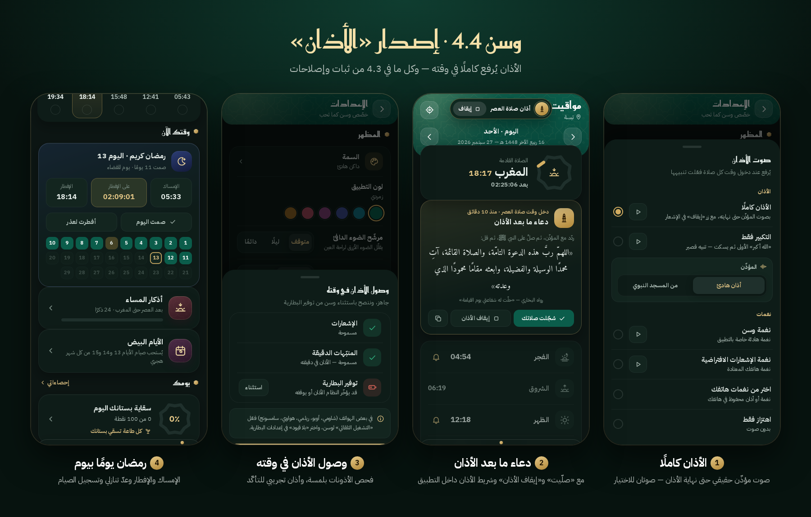

<div dir="rtl">

# وسن · Wasan 4.4

**رفيقك اليومي للصلاة والقرآن والذكر** — تطبيق أندرويد يعمل دون إنترنت ودون إعلانات.



## التحميل

- **التطبيق الجاهز:** [release/Wasan-4.4.apk](release/Wasan-4.4.apk) — يُثبَّت فوق النسخ السابقة مباشرة وتبقى بياناتك.
- **المعاينة الحيّة:** [preview/Wasan-4.4-Live-Preview.html](preview/Wasan-4.4-Live-Preview.html) — نزّل الملف وافتحه في متصفح الهاتف.

## ما الجديد في 4.4

- **الأذان كاملًا** بصوت مؤذّن حقيقي — صوتان للاختيار، مع «إيقاف الأذان» في الإشعار وداخل التطبيق. يحترم الوضع الصامت ويتوقف عند المكالمة.
- **دعاء ما بعد الأذان** في شاشة المواقيت مع زر «صلّيت».
- **تذكير صلاة الجمعة**، وزر **«جرّب الأذان الآن»** للتأكد من وصول الأذان في وقته.
- **كل ما في 4.3:** رمضان يومًا بيوم، وجدولة الأذان لثلاثين يومًا تتجدّد وحدها، وإصلاحات.

## المزايا

مواقيت دقيقة بطرق حساب متعددة · مصحف كامل بالرسم العثماني مع التلاوة والبحث والختمة ووضع الحفظ · أذكار من «حصن المسلم» · القبلة · المسبحة · التقويم الهجري · قضاء الفوائت · العادات والمهام · بستان بألف مستوى وأوسمة · نسخ احتياطي واستعادة.

## البناء من المصدر

يُبنى المشروع دون Gradle بسكربت واحد:

```
python fetch_deps.py      # مرة واحدة: تنزيل مكتبات AndroidX إلى .deps
python build_apk.py all   # aapt2 → kotlinc → d8 → zipalign → apksigner
```

يحتاج: Android SDK (build-tools 34 وplatform android-34) وJDK 21 وKotlin 1.9.22 — تُضبط المسارات بمتغيرات البيئة `WASAN_SDK` و`WASAN_JAVA` و`WASAN_KOTLIN_LIB`.

**مفتاح التوقيع غير مرفوع** لأن المستودع عام — انظر [signing/README.md](signing/README.md).

## هيكل المشروع

- `app/src/main/assets/www/` — الواجهة كاملة (HTML · CSS · JS).
- `app/src/main/java/com/app/` — النواة الأصلية (Kotlin): الأذان، الموقع، الأدوات، التلاوة.
- `app/src/main/res/raw/` — تسجيلات الأذان ونغمة وسن.
- `README.txt` — سجلّ التغييرات المفصّل لكل إصدار.

## المصادر والتراخيص

- **نص القرآن:** الرسم العثماني برواية حفص عن عاصم، بخط مجمّع الملك فهد (KFGQPC Uthmanic Hafs).
- **الخطوط:** IBM Plex Sans Arabic وReem Kufi وAmiri — رخصة SIL Open Font License 1.1.
- **المدن:** GeoNames.org — رخصة CC BY 4.0.
- **الأذان:** «أذان هادئ» — Adam-synagda (ملك عام CC0) · «من المسجد النبوي» — ejaz215 عبر Freesound (CC BY 3.0) · من ويكيميديا كومنز.

</div>
